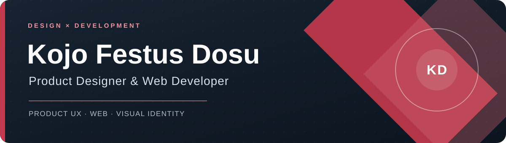
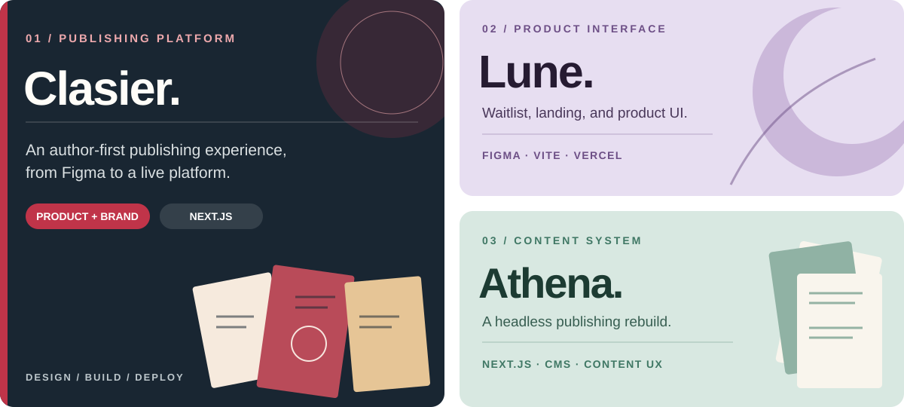

  

  <a href="https://dosujr.com"><b>PORTFOLIO ↗</b></a>
  &nbsp;&nbsp;·&nbsp;&nbsp;
  <a href="https://www.dosujr.com/project/clasierpub"><b>FEATURED CASE STUDY ↗</b></a>
  &nbsp;&nbsp;·&nbsp;&nbsp;
  <a href="mailto:ultramynd@gmail.com"><b>EMAIL ME ↗</b></a>

 

<h2 align="center">From first sketch to working product.</h2>

  I’m Kojo, a product designer and web developer in Abuja, Nigeria. 
  I turn requirements into interfaces, identities, websites, and useful product experiences.

 

## Selected work

**01 / Clasier Publishing** — I led the UX and visual direction, then designed and built the publishing website. [Read the case study ↗](https://www.dosujr.com/project/clasierpub) · [Visit the site ↗](https://clasier.pub)  
**02 / Lune** — Waitlist, landing page, and product UI.  
**03 / Athena Centre** — Headless content and publishing experience.

<a href="https://dosujr.com"><b>Explore more work on my portfolio →</b></a>

## In my workflow

`Figma` &nbsp; `Next.js` &nbsp; `WordPress` &nbsp; `Framer` &nbsp; `Photoshop` &nbsp; `Illustrator` &nbsp; `GitHub` &nbsp; `Codex` &nbsp; `Claude`

My design practice grew from print and publishing into digital products. I work across product UX, brand systems, and web delivery, using AI tools to prototype and iterate. I’m studying **Software Engineering at Miva Open University** to deepen the engineering side of that work.

 

  <a href="mailto:ultramynd@gmail.com">ultramynd@gmail.com</a> &nbsp;·&nbsp;
  <a href="https://dosujr.com">dosujr.com</a> &nbsp;·&nbsp;
  Abuja, Nigeria

