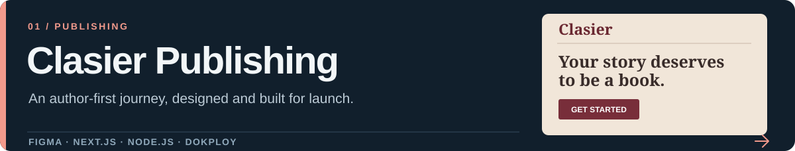
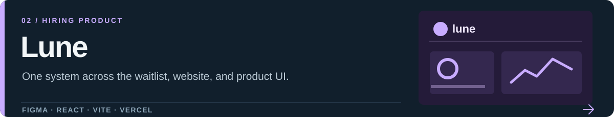
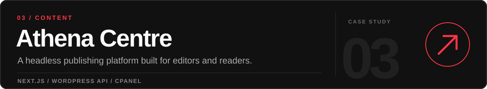

  

  <a href="https://dosujr.com"><b>Portfolio</b></a> &nbsp;·&nbsp;
  <a href="https://dosujr.com/project"><b>Case studies</b></a> &nbsp;·&nbsp;
  <a href="mailto:ultramynd@gmail.com"><b>Email</b></a>

  I turn early ideas into clear interfaces and working websites. 
  My background in publishing and visual design shapes how I approach product UX, content, and code.

 

## Selected work

Designed the author journey and visual direction, then built the site in Next.js. [Case study ↗](https://dosujr.com/project/clasierpub) · [Live site ↗](https://clasier.pub)

Designed and built the waitlist, landing page, and product UI as one connected experience. [Case study ↗](https://dosujr.com/project/lune-platform) · [Live site ↗](https://lunehire.com)

Built a custom Next.js front end over WordPress so the team could keep its editorial workflow. [Case study ↗](https://dosujr.com/project/athena-centre) · [Live site ↗](https://athenacentre.org)

<b>More work</b>

 

- [Stephen Lazi Akhere, PhD](https://dosujr.com/project/stephen-laziak) — website, publications archive, and embedded audio.
- [Thrive Network](https://dosujr.com/project/thrive-network) — service-led website for distinct audiences.
- [Clasier rebrand and campaign](https://dosujr.com/collection/clasier-rebrand) — visual identity and campaign work.

 

## What I work with

**Design** &nbsp; `Figma` `Framer` `Photoshop` `Illustrator`  
**Build** &nbsp;&nbsp;&nbsp; `Next.js` `React` `WordPress` `HTML/CSS`  
**Ship** &nbsp;&nbsp;&nbsp;&nbsp; `GitHub` `Vercel` `Dokploy` `cPanel`

I work from requirements and user flows through interface design, implementation, and launch. I use Codex and Claude for prototyping and iteration, then review the result against the real brief and product experience.

## Public code

**[ScribeAI ↗](https://github.com/ultramynd/ai-scribe-tool)** — an AI-assisted transcription and documentation app in progress. Most of my client work is represented by the [case studies on my portfolio](https://dosujr.com/project).

## Right now

I'm studying **Software Engineering at Miva Open University** while continuing to design and build products across UX, brand, and web. I’m especially interested in work where product decisions and implementation need to move together.

 

  <a href="mailto:ultramynd@gmail.com">ultramynd@gmail.com</a> &nbsp;·&nbsp;
  <a href="https://dosujr.com">dosujr.com</a> &nbsp;·&nbsp;
  Abuja, Nigeria

